# DuoMiniLesson - Spanish Language Learning App

A comprehensive React Native language learning application designed to teach Spanish vocabulary through interactive exercises. The app supports both English and Arabic interface languages, making it accessible to a diverse global audience.

## 🎯 App Overview

DuoMiniLesson is a mobile-first language learning platform that combines gamification elements with educational content to create an engaging Spanish learning experience. The app features multiple exercise types, progress tracking, and accessibility support.

## 🏗️ Architecture & Technical Implementation

### Core Technologies

- **React Native 0.81.1** - Cross-platform mobile development
- **TypeScript** - Type-safe development
- **Zustand** - State management with persistence
- **React Navigation** - Screen navigation
- **React i18next** - Internationalization
- **AsyncStorage** - Data persistence
- **React Native Video** - Audio playback for listening exercises

### State Management Architecture


### Data Flow Diagram


## 🎮 Exercise Types & Logic

### 1. Multiple Choice Questions (MCQ)

**Purpose**: Test vocabulary recognition and comprehension
**Logic**:

- Present question with 4 Spanish word options
- User selects one option
- Immediate feedback with correct/incorrect indication
- Visual styling changes based on result

```typescript
interface MCQProps {
  question: string; // "What is the Spanish word for 'Hello'?"
  options: string[]; // ["Hola", "Adiós", "Gracias", "Por favor"]
  correctAnswer: number; // Index of correct option (0)
  onAnswer: (selectedIndex: number) => void;
  showResult?: boolean; // Show correct/incorrect styling
}
```

### 2. Type Answer

**Purpose**: Test spelling and recall ability
**Logic**:

- Present translation question
- User types Spanish word/phrase
- Case-insensitive comparison with normalization
- Real-time input validation

```typescript
interface TypeAnswerProps {
  question: string; // "Translate 'Thank you' to Spanish:"
  correctAnswer: string; // "gracias"
  onAnswer: (answer: string) => void;
  showResult?: boolean; // Show result styling
}
```

### 3. Word Bank

**Purpose**: Test contextual understanding and sentence completion
**Logic**:

- Present incomplete Spanish sentence
- User selects correct word from bank
- Contextual validation for sentence completion

```typescript
interface WordBankProps {
  question: string; // "Complete: 'Yo ___ a la escuela'"
  words: string[]; // ["voy", "vas", "va", "vamos"]
  correctAnswer: string; // "voy"
  onAnswer: (selectedWord: string) => void;
}
```

### 4. Match Pairs

**Purpose**: Test vocabulary association and memory
**Logic**:

- Present English-Spanish word pairs
- User matches corresponding translations
- All pairs must be correct for completion
- Visual feedback for each match

```typescript
interface MatchPairsProps {
  question: string; // "Match English with Spanish:"
  pairs: Pair[]; // [{left: "Book", right: "Libro"}]
  onAnswer: (matches: Record<string, string>) => void;
}
```

### 5. Listening Exercise

**Purpose**: Test pronunciation recognition and listening comprehension
**Logic**:

- Play Spanish audio file
- User types what they hear
- Tolerance-based matching for pronunciation variations
- Audio controls for replay

```typescript
interface ListeningProps {
  question: string; // "Listen and type what you hear:"
  audioUrl: string; // "hola.mp3"
  correctAnswer: string; // "hola"
  tolerance: number; // Pronunciation tolerance (0-2)
  onAnswer: (text: string) => void;
}
```

## 🎨 User Experience (UX) Design

### Visual Design System


### Screen Flow & Navigation


### Gamification Elements

#### Hearts System

- **Initial Hearts**: 3 hearts
- **Heart Loss**: Incorrect answer removes 1 heart
- **Game Over**: 0 hearts triggers lesson restart
- **Visual Feedback**: Heart icons with animations

#### XP & Streak System

- **XP Points**: Earned for correct answers
- **Streak Counter**: Consecutive correct answers
- **Progress Tracking**: Visual progress bar
- **Achievement System**: Streak milestones

#### Progress Visualization

```mermaid
graph LR
    A[Progress Bar] --> B[Current: 1/7]
    A --> C[Percentage: 14%]
    A --> D[Visual Fill]

    E[Hearts Display] --> F[❤️❤️❤️]
    E --> G[❤️❤️💔]
    E --> H[❤️💔💔]
    E --> I[💔💔💔]

    J[Streak Counter] --> K[🔥 0]
    J --> L[🔥 3]
    J --> M[🔥 5]
```



## 🌍 Internationalization (i18n)

### Language Support Structure

- **Interface Languages**: English, Arabic (RTL)
- **Learning Language**: Spanish
- **Content Localization**: All UI text, instructions, and feedback

### RTL (Right-to-Left) Support

```typescript
// Automatic RTL layout handling
const styles = StyleSheet.create({
  container: {
    flexDirection: I18nManager.isRTL ? 'row-reverse' : 'row',
    textAlign: I18nManager.isRTL ? 'right' : 'left',
  },
});
```

### Translation Structure

```json
{
  "common": {
    "next": "Next",
    "finish": "Finish",
    "loading": "Loading..."
  },
  "exercises": {
    "mcq": {
      "selectAnswer": "Select the correct answer"
    },
    "typeAnswer": {
      "typeAnswer": "Type your answer:",
      "placeholder": "Enter Spanish word..."
    }
  },
  "a11y": {
    "questionNumber": "Question {{current}} of {{total}}",
    "submitAnswer": "Submit answer"
  }
}
```

## ♿ Accessibility Features

### Screen Reader Support

- **VoiceOver (iOS)**: Full navigation support
- **TalkBack (Android)**: Complete screen reader integration
- **Accessibility Labels**: Descriptive text for all interactive elements
- **Accessibility Hints**: Additional context for complex interactions

### Keyboard Navigation

- **Tab Order**: Logical focus progression
- **Focus Management**: Automatic focus on input fields
- **Keyboard Shortcuts**: Submit on Enter key
- **Focus Indicators**: Clear visual focus states

### Visual Accessibility

- **High Contrast**: WCAG AA compliant color schemes
- **Touch Targets**: Minimum 44dp touch areas
- **Font Scaling**: Support for system font size preferences
- **Color Independence**: Information not conveyed by color alone

## 📱 Platform-Specific Features

### Android Implementation

- **Vibration Permission**: Haptic feedback for answers
- **Status Bar**: Hidden for immersive experience
- **Safe Area**: Proper handling of system UI
- **Back Button**: Navigation support

### iOS Implementation

- **Haptic Feedback**: Native iOS haptic patterns
- **Safe Area**: Automatic safe area handling
- **Status Bar**: Transparent with proper styling
- **Gesture Navigation**: Swipe back support

## 🔧 Technical Implementation Details

### State Persistence

```typescript
// Zustand store with AsyncStorage persistence
interface LessonState {
  lesson: Lesson | null;
  currentIndex: number;
  hearts: number;
  streak: number;
  xp: number;
  isComplete: boolean;
  isGameOver: boolean;
}

// Automatic save/restore
const useLessonStore = create<LessonState>()(
  persist(
    (set, get) => ({
      // State implementation
    }),
    {
      name: 'lesson-storage',
      storage: createJSONStorage(() => AsyncStorage),
    },
  ),
);
```

### Error Handling

- **Network Errors**: Graceful degradation
- **Storage Errors**: Fallback to memory state
- **Audio Errors**: Alternative text-based exercises
- **Validation Errors**: User-friendly error messages

### Performance Optimizations

- **Lazy Loading**: Components loaded on demand
- **Memoization**: React.memo for expensive components
- **Bundle Splitting**: Separate bundles for different features
- **Image Optimization**: Compressed assets and lazy loading

## 🧪 Testing Strategy

### Test Coverage

- **Unit Tests**: 70+ test cases covering all components
- **Integration Tests**: State management and persistence
- **Accessibility Tests**: Screen reader and keyboard navigation
- **E2E Tests**: Complete user journey validation

### Test Types


## 🚀 Build & Deployment

### Development Build

```bash
# Install dependencies
npm install

# iOS setup
cd ios && pod install && cd ..

# Run development
npm run ios
npm run android
```

### Production Build

```bash
# Android Release APK
cd android && ./gradlew assembleRelease

# Output: android/app/build/outputs/apk/release/app-release.apk
```

### Build Configuration

- **Debug Build**: Development features enabled
- **Release Build**: Optimized for production
- **Code Signing**: Proper certificate configuration
- **Asset Optimization**: Compressed images and fonts

## 📊 Analytics & Monitoring

### User Engagement Metrics

- **Exercise Completion Rate**: Track user progress
- **Error Rate**: Monitor technical issues
- **Session Duration**: Measure engagement
- **Feature Usage**: Identify popular exercises

### Performance Monitoring

- **App Launch Time**: Track startup performance
- **Memory Usage**: Monitor resource consumption
- **Crash Reports**: Automatic error reporting
- **Network Performance**: API response times

## 🔮 Future Enhancements

### Planned Features

- **Offline Mode**: Complete offline functionality
- **Social Features**: Leaderboards and sharing
- **Advanced Analytics**: Detailed learning insights
- **Voice Recognition**: Speech-to-text exercises
- **AR Integration**: Augmented reality vocabulary

### Scalability Considerations

- **Multi-Language Support**: Additional interface languages
- **Content Management**: Dynamic lesson updates
- **User Accounts**: Cloud sync and progress backup
- **Adaptive Learning**: AI-powered difficulty adjustment

## 📄 License & Credits

This project is developed as a demonstration of modern React Native development practices, incorporating accessibility, internationalization, and comprehensive testing strategies.

---

**Built with ❤️ using React Native, TypeScript, and modern mobile development best practices.**
